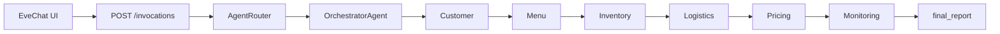

# Eve Cater's AI — Agents Overview

A short guide to **who does what** in the multi-agent catering system: orchestrators, specialist agents, internal pipeline steps, and optional alternate runtimes.

**Default runtime:** `OrchestratorAgent` runs a fixed pipeline (DAG). There are no separate Python classes named “sub-agents”; each specialist agent runs an **internal multi-step pipeline** (documented below as *pipeline steps*).

---

## System layers

| Layer | Component | Role |
|--------|-----------|------|
| **Customer UI** | `EveChat` (`app/chat.py`) | Menu-driven booking chat; collects country, event, menu, date, guests, budget; calls the API when a plan is needed. Not part of the backend DAG. |
| **API / router** | `AgentRouter` (`app/runtime/router.py`) | Chooses orchestration backend and returns `message_trace` + `final_report`. |
| **Orchestration** | `OrchestratorAgent` (default) | Runs specialists in order, persists shared context, builds the final report. |
| **Specialists** | 5 domain agents + 1 observer | Customer → Menu → Inventory → Logistics → Pricing, then Monitoring. |
| **Tools & KBs** | `ToolRegistry`, `YAMLKBSearch` | Data and logic each agent queries (recipes, stock, schedules, pricing, 38 YAML KBs). |

---

## Orchestrator agents

These components **coordinate** specialists; they do not plan menus or prices themselves.

### 1. `OrchestratorAgent` (main — default)

**File:** `app/orchestrator.py`

**What it does:**

- Declares the plan: intake → menu → inventory → logistics → pricing.
- Calls each specialist’s `process()` in sequence.
- Records **agent-to-agent messages** (`AgentMessage` trace).
- Saves **`CateringPlanContext`** after every step (memory or Cosmos placeholder).
- Builds **`final_report`** (event summary, menu, procurement, logistics, pricing, monitoring).
- Optionally asks the LLM for a short **client narrative** when `USE_LLM=true`.

**When it runs:** Every `POST /invocations`, `test_scenarios.py` (direct), and as the **fallback** for MAF/AutoGen placeholders.

---

### 2. `AgentRouter` (runtime entry)

**File:** `app/runtime/router.py`

**What it does:**

- Single entry for the HTTP API and A2A messages.
- Delegates to `app/platform/orchestration.run_catering_flow()` which picks:
  - **native DAG** — `OrchestratorAgent` (default)
  - **Microsoft AutoGen** — group-chat specialists (`USE_AUTOGEN=true`)
  - **Microsoft Agent Framework** — placeholder; still runs DAG today (`USE_MS_AGENT_FRAMEWORK=true`)

---

### 3. `MSAgentFrameworkOrchestratorPlaceholder` (optional — future)

**File:** `app/platform/ms_agent_framework/orchestrator_placeholder.py`

**What it does:**

- Target swap-in for MAF **Workflow / Agent team** orchestration.
- **Today:** runs the same native DAG and adds `platform` metadata + a notice.

---

### 4. `MicrosoftAgentFrameworkAdapter` (optional — AutoGen)

**File:** `app/runtime/ms_autogen_adapter.py`

**What it does:**

- **Not** the Microsoft Agent Framework SDK — this is **AutoGen** `RoundRobinGroupChat`.
- Spins up six `AssistantAgent` roles (Customer, Menu, Inventory, Logistics, Pricing, Monitoring) that hand off via `HANDOFF:*` / `PLAN_COMPLETE`.
- Requires `autogen-agentchat` and `USE_LLM=true`.

---

## Main specialist agents

Each row is a **first-class agent** in the pipeline. All except Customer use **`LLMReasoningMixin`** for optional natural-language reasoning when `USE_LLM=true`.

| Agent | Class | Module | Primary output |
|--------|--------|--------|----------------|
| **Customer** | `CustomerInteractionAgent` | `customer_agent.py` | Structured event brief |
| **Menu** | `MenuPlanningAgent` | `menu_agent.py` | `menu_items`, constraints, KB trace |
| **Inventory** | `InventoryProcurementAgent` | `inventory_agent.py` | Procurement list, shortages, vendors |
| **Logistics** | `LogisticsPlanningAgent` | `logistics_agent.py` | Staffing, vehicles, runsheet, compliance |
| **Pricing** | `PricingOptimizationAgent` | `pricing_agent.py` | Quote, margin, budget fit |
| **Monitoring** | `MonitoringAgent` | `monitoring_agent.py` | Risks, escalations, health status |

---

### Customer Interaction Agent

**Job:** Turn raw booking input into a **structured brief** every other agent trusts.

**Key behaviours:**

- Validates required fields (event type, guests, dietary, budget, location, date, service style).
- Normalises currency and **budget per head**.
- Loads **event profiles**, **dietary/allergen** rules, **cultural norms**, **CRM/history**, **service packages**, **venue hints**, **FAQ/policies**.

**KBs (examples):** `customer/event_profiles`, `customer/dietary_restrictions`, `customer/cultural_norms`, `customer/service_packages`, `customer/faq_policies`.

**Downstream:** Feeds Menu, Inventory, Logistics, Pricing.

---

### Menu Planning Agent

**Job:** Build a **complete, compliant menu** (dishes, portions, equipment/season flags).

**Key behaviours:**

- Filters **recipe library** by dietary, service style, scale, occasion.
- Applies **cuisine trends** and menu-balance templates.
- Validates **portions/yields**, **seasonal** ingredients, **equipment** at venue type.
- Scores against **past menu performance**.

**Tools / KBs:** `RecipeCatalogueTool`, `menu/recipe_library`, `menu/cuisine_trends`, `menu/portion_yield`, `menu/equipment_capability`, `menu/menu_performance`, shared seasonal KBs.

**Downstream:** `menu_items` → Inventory & Logistics; menu cost basis → Pricing.

---

### Inventory & Procurement Agent

**Job:** Convert the menu into **ingredient quantities**, check stock, and produce a **purchase plan**.

**Key behaviours:**

- Maps dishes → ingredients (`ingredient_recipe_map`).
- Subtracts on-hand stock; applies **spoilage/waste** buffers.
- Flags **seasonal** supply risks.
- Assigns **suppliers** via catalog + vendor performance.
- Applies **procurement SOP** (approval tiers).

**Tools / KBs:** `InventoryDBTool`, `inventory/*` KBs, `shared/seasonal_availability`.

**Downstream:** Shortages and procurement list → Logistics & Pricing; Monitoring watches shortages.

---

### Logistics Planning Agent

**Job:** Plan **how the event runs on the ground** — people, time, transport, safety, permits.

**Key behaviours:**

- Matches **venue profile** (access, kitchen, constraints).
- Loads **runsheet** template for event type.
- Builds **staffing** model by guest count and service style.
- Plans **routes/vehicles** and **cold chain**.
- Checks **equipment** needs vs gaps.
- Applies **food safety** and **compliance** checklists.
- Uses **execution logs** for venue lessons learned.

**Tools / KBs:** `SchedulerAPITool`, `logistics/*` KBs, shared venue index.

**Downstream:** Staffing and transport costs inform Pricing; flags feed Monitoring.

---

### Pricing Optimization Agent

**Job:** Turn costs into a **defensible quote** that protects margin and fits the customer budget.

**Key behaviours:**

- **Cost of goods** from menu ingredients.
- **Overhead & labour** from logistics staffing model.
- **Seasonal** price surcharges.
- **Market benchmarks** and competitor context.
- **Discounts** with margin floors.
- **Historical quotes** validation.
- **Price elasticity** / tier recommendation.

**Tools / KBs:** `PricingEngineTool`, `pricing/*` KBs, `shared/competitor_pricing`, `shared/seasonal_availability`.

**Downstream:** `recommended_total_quote`, `budget_fit` → final report & Monitoring.

---

### Monitoring Agent

**Job:** **Observer** after all specialists finish — does not change the menu or quote.

**Key behaviours:**

- Reads full `CateringPlanContext`.
- Aggregates **shortages**, **logistics risks**, **budget overrun**, **simulation/seasonal** alerts.
- Sets `health_status` (`OK` vs `ESCALATION_REQUIRED`).
- Optional LLM **executive summary** of plan health.

**Runs:** After pricing, before `final_report` is returned.

---

## Internal pipeline steps (“sub-agents”)

These are **not** separate deployable agents. They are **numbered steps** inside each specialist’s `process()` method — useful when mapping to Microsoft Agent Framework tools or workflows later.

### Customer — 9 steps

1. Validate / normalise input  
2. Event profile template  
3. Dietary & allergen flags  
4. Cultural norms  
5. CRM / interaction history  
6. Service package match  
7. Venue compatibility  
8. FAQ / policies  
9. Assemble brief + `kb_sources`  

### Menu — 8 steps

1. Dietary constraints  
2. Recipe library filter  
3. Cuisine trends & menu balance  
4. Portion & yield validation  
5. Seasonal availability  
6. Equipment capability  
7. Past menu performance  
8. Assemble menu output  

### Inventory — 8 steps

1. Receive menu + guest count  
2. Ingredient breakdown (recipe map)  
3. Stock subtract  
4. Spoilage/waste buffers  
5. Seasonal warnings  
6. Vendor selection  
7. Procurement SOP / approvals  
8. Purchase plan output  

### Logistics — 8 steps

1. Venue profile  
2. Runsheet template  
3. Staffing schedule  
4. Routes & transport  
5. Equipment allocation  
6. Food safety / cold chain  
7. Compliance checklist  
8. Execution logs / learnings  

### Pricing — 8 steps

1. Cost of goods  
2. Overhead & labour  
3. Seasonal adjustments  
4. Market benchmarks  
5. Discounts & margin floor  
6. Historical quote validation  
7. Price elasticity  
8. Tiered quote output  

### Monitoring — 4 logical checks

1. Inventory / shortage risks  
2. Logistics risks  
3. Pricing / budget fit  
4. Seasonal / simulation escalations  

---

## Supporting components (not pipeline agents)

| Component | File | Purpose |
|-----------|------|---------|
| **LLMReasoningMixin** | `llm_mixin.py` | Shared optional LLM calls for specialists (Ollama, Azure OpenAI, Foundry placeholder). |
| **platform_bridge** | `platform_bridge.py` | Metadata hook for future MAF/Foundry per-agent labels. |
| **ToolRegistry** | `tools/registry.py` | Injects recipe, inventory DB, scheduler, pricing engine, YAML KB (and Azure Search stub). |

---

## Message flow (default DAG)

| Step | Sender | Recipient | Message type |
|------|--------|-----------|----------------|
| 0 | `orchestrator` | `customer_agent` | `plan_decomposed` |
| 1 | `customer_agent` | `menu_agent` | `customer_profile` |
| 2 | `menu_agent` | `inventory_agent` | `menu_plan` |
| 3 | `inventory_agent` | `logistics_agent` | `procurement_status` |
| 4 | `logistics_agent` | `pricing_agent` | `logistics_plan` |
| 5 | `pricing_agent` | `orchestrator` | `final_pricing` |
| 6 | `monitoring_agent` | `orchestrator` | `execution_review` |

---

## Knowledge bases by agent (summary)

| Agent | KB folders |
|--------|------------|
| Customer | `customer/*` |
| Menu | `menu/*` + customer dietary |
| Inventory | `inventory/*` + `shared/seasonal_availability` |
| Logistics | `logistics/*` + `shared/venue_index` |
| Pricing | `pricing/*` + shared pricing/seasonal |
| All | `shared/*` where referenced (feedback, postmortems, trends, etc.) |

---

## Related docs

- [microsoft-agent-framework-architecture.md](./microsoft-agent-framework-architecture.md) — how orchestration could move to MAF + Azure Foundry + AI Search  
- [architecture-microsoft-agent-framework.md](./architecture-microsoft-agent-framework.md) — Azure AI Foundry hub mapping to repo modules  
- [README.md](../README.md) — setup, env vars, and running chat/API  
