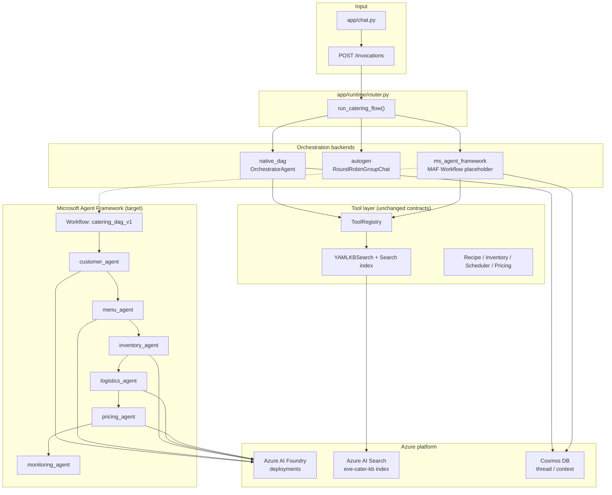

# Microsoft Agent Framework — Target Architecture (Eve Cater's AI)

This document describes how to **switch** Eve Cater's AI from the current **native in-process DAG** to **Microsoft Agent Framework (MAF)**, with **Azure AI Foundry** for models and **Azure AI Search** for KB RAG. It matches the placeholder modules under `app/platform/`.

**Today:** placeholders only (~50% design surfaced). Runtime behaviour is unchanged unless you set flags; MAF path still executes the native DAG and annotates responses.

---

## 1. Current vs target

| Layer | Today (default) | Target (when switched) |
|--------|-----------------|-------------------------|
| Orchestration | `OrchestratorAgent` fixed DAG | MAF Workflow / Agent team + handoffs |
| Specialist agents | Python classes + YAML KB | MAF `Agent` per specialist + tools |
| LLM | Ollama / OpenAI-compatible / Azure OpenAI | **Azure AI Foundry** project deployments |
| KB / RAG | `YAMLKBSearch` keyword overlap | **Azure AI Search** hybrid index + YAML fallback |
| Thread state | `CateringPlanContext` + Memory/Cosmos store | MAF thread + Cosmos (`CosmosContextStore`) |
| Chat / API | `AgentRouter` → `run_catering_flow` | Same router; backend = `ms_agent_framework` |

---

## 2. Orchestration backends (env)

Set in `.env` (see `.env.example`):

| Variable | Values | Effect |
|----------|--------|--------|
| `ORCHESTRATION_BACKEND` | `native_dag` \| `autogen` \| `ms_agent_framework` | Explicit backend |
| `USE_MS_AGENT_FRAMEWORK` | `true` / `false` | Enables MAF placeholder path |
| `USE_AUTOGEN` | `true` / `false` | AutoGen group-chat (separate from MAF) |
| `USE_AZURE_AI_FOUNDRY` | `true` / `false` | Route LLM via Foundry stub |
| `USE_AZURE_AI_SEARCH` | `true` / `false` | Invoke Search stub on KB queries |

**Priority when `ORCHESTRATION_BACKEND` is unset:** `USE_MS_AGENT_FRAMEWORK` → `USE_AUTOGEN` → `native_dag`.

**Entry point:** `app/platform/orchestration.py` → `run_catering_flow()`.

---

## 3. High-level architecture (target)



---

## 4. Repo map (placeholder modules)

```
app/platform/
  config.py                 # Backend flags + platform_metadata()
  orchestration.py          # run_catering_flow() switch
  ms_agent_framework/
    orchestrator_placeholder.py   # MAF run → fallback DAG
    agent_registry_placeholder.py   # 6 specialists → future MAF Agent defs
    workflows_placeholder.py        # Serial handoff graph
  foundry/
    client_placeholder.py           # AIProjectClient stub
    deployments_placeholder.py      # agent → deployment map
  search/
    azure_ai_search_placeholder.py  # SearchClient stub
    kb_index_mapping_placeholder.py   # YAML path → index facets

app/agents/platform_bridge.py       # Per-agent metadata hook (optional)
```

Existing specialists (`app/agents/*.py`) stay the **source of truth** for business logic until each is wrapped as a MAF tool or migrated to MAF-native instructions + tools.

---

## 5. Agent pipeline (unchanged semantics)

Fixed DAG (same as `OrchestratorAgent.decompose_plan()`):

1. **Customer** — intake, dietary, cultural norms, packages  
2. **Menu** — recipe filter, cuisine trends, equipment, performance  
3. **Inventory** — procurement, suppliers, seasonal warnings  
4. **Logistics** — venue, staffing, transport, compliance  
5. **Pricing** — COGS, overhead, benchmarks, quote  
6. **Monitoring** — risks, escalations, health status  

**MAF mapping:** one `Agent` per row; `handoff_to` in `workflows_placeholder.py` mirrors message types in `SessionState.messages`.

---

## 6. Azure AI Foundry (models)

**Goal:** Centralise model deployments in a Foundry **project** instead of scattering `AZURE_OPENAI_*` per agent.

| Role | Env | Typical deployment |
|------|-----|-------------------|
| Orchestrator / monitoring | `AZURE_AI_FOUNDRY_DEPLOYMENT_ORCH` | gpt-4o |
| Specialists | `AZURE_AI_FOUNDRY_DEPLOYMENT_SPECIALIST` | gpt-4o-mini |

**Integration points:**

- `app/agents/llm_mixin.py` — try Foundry before `LLMProvider` when `USE_AZURE_AI_FOUNDRY=true`
- `app/providers/azure_openai.py` — legacy path until Foundry client is implemented
- `app/platform/foundry/client_placeholder.py` — implement `AIProjectClient` + agent runs here

---

## 7. Azure AI Search (RAG)

**Goal:** Index flattened chunks from `app/tools/data/kb/**/*.yaml` into index `eve-cater-kb`.

| Field (conceptual) | Source |
|--------------------|--------|
| `agent_scope` | `customer`, `menu`, `inventory`, … |
| `kb_path` | e.g. `menu/recipe_library` |
| `text` | YAML record serialised |
| `dietary_tags`, `event_types` | Recipe / profile metadata |

**Integration points:**

- `app/tools/kb_yaml.py` — optional hybrid call (placeholder no-op)
- `app/tools/registry.py` — `azure_ai_search_kb` property
- `app/platform/search/kb_index_mapping_placeholder.py` — sync mapping

**Blended RAG strategy (recommended):** Search top-k + YAML keyword RAG-lite merge + de-duplicate by `kb_path`.

---

## 8. Shared context & threading

| Concept | Current | MAF target |
|---------|---------|------------|
| `thread_id` | API / chat UUID | MAF conversation / thread id |
| `CateringPlanContext` | Updated after each step | Serialized into thread state store |
| Persistence | `MemoryContextStore` / `CosmosContextStore` | Cosmos container per thread |

`final_report.platform` and `final_report.shared_context_snapshot` already expose metadata for clients and observability.

---

## 9. Migration checklist (when you implement)

### Phase A — Platform wiring (no behaviour change)

- [x] Placeholders under `app/platform/`
- [x] Router uses `run_catering_flow`
- [x] `platform` block on `final_report` and `/health`

### Phase B — Azure AI Search

- [ ] Provision Search service + index `eve-cater-kb`
- [ ] Indexer: YAML → chunks (use `KB_INDEX_FIELD_MAP`)
- [ ] Implement `AzureAISearchKBPlaceholder.search()` merge in `YAMLKBSearch`

### Phase C — Azure AI Foundry

- [ ] Provision Foundry project + deployments
- [ ] Implement `AzureAIFoundryClientPlaceholder.generate()`
- [ ] Point `LLMReasoningMixin` / orchestrator narrative to Foundry

### Phase D — Microsoft Agent Framework (~50% → 100%)

- [ ] `pip install agent-framework`
- [ ] Register 6 specialists in `register_specialist_agents_placeholder()`
- [ ] Implement workflow execution in `MSAgentFrameworkOrchestratorPlaceholder.run()` (stop calling `native_runner` by default)
- [ ] Map `ToolRegistry` tools to MAF function tools
- [ ] Wire Cosmos as MAF-compatible thread store

### Phase E — Observability & security

- [ ] App Insights: trace MAF run ids + `thread_id`
- [ ] Entra ID on `/invocations` (already optional via `ENTRA_AUDIENCE`)

---

## 10. How to exercise placeholders locally

```bash
# MAF path (still runs native DAG, adds notice + platform metadata)
USE_MS_AGENT_FRAMEWORK=true
ORCHESTRATION_BACKEND=ms_agent_framework
python -m app.main

# Foundry + Search stubs (no external calls yet)
USE_AZURE_AI_FOUNDRY=true
USE_AZURE_AI_SEARCH=true
```

```bash
python test_scenarios.py   # prints platform banner; uses OrchestratorAgent directly
```

API responses include `final_report.platform` and optional `ms_agent_framework_notice`.

---

## 11. Related docs

- [architecture-microsoft-agent-framework.md](./architecture-microsoft-agent-framework.md) — Azure AI Foundry **hub** diagram mapped to current modules (pre-MAF naming)
- [.env.example](../.env.example) — all platform toggles

---

## 12. Design principles

1. **One DAG, multiple engines** — Business rules stay in specialist agents; only orchestration and retrieval swap.  
2. **Fail open to native DAG** — MAF/AutoGen unavailable → deterministic pipeline (reliable demos).  
3. **Traceability** — `kb_sources`, `message_trace`, and `platform` metadata preserved for audits.  
4. **Southeast Asia domain unchanged** — Country, currency, halal, and venue KBs remain YAML-first until Search index is populated.
