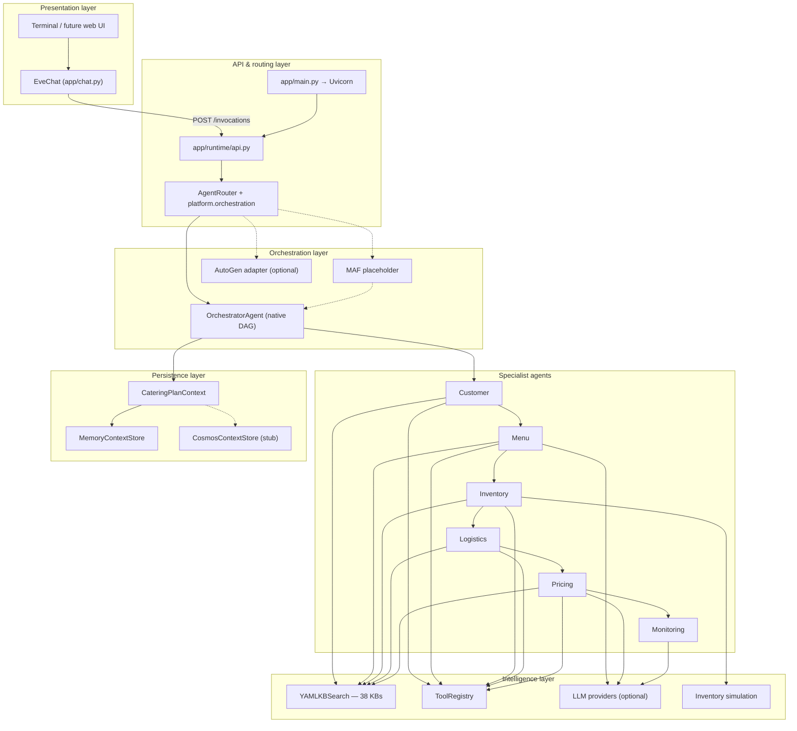
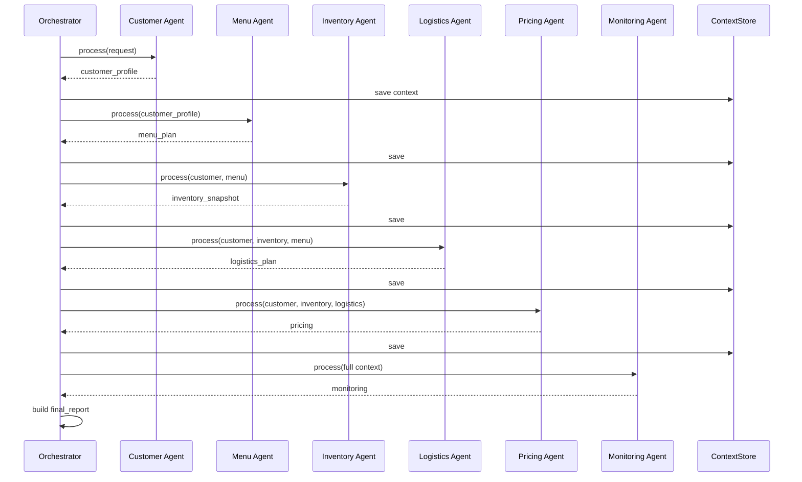

# Eve Cater's AI — System Architecture (Detailed)

This document describes the **end-to-end architecture** of Eve Cater's AI: how customers interact with Eve, how the API and orchestrator run six specialist agents, how knowledge bases and tools fit in, and how optional Microsoft/Azure integration paths are structured.

**Related docs (deeper dives):**

| Document | Focus |
|----------|--------|
| [agents-overview.md](./agents-overview.md) | Orchestrators, specialists, internal pipeline steps |
| [knowledge-bases-overview.md](./knowledge-bases-overview.md) | All 38 YAML KBs |
| [microsoft-agent-framework-architecture.md](./microsoft-agent-framework-architecture.md) | Future MAF + Foundry + AI Search switch |
| [architecture-microsoft-agent-framework.md](./architecture-microsoft-agent-framework.md) | Azure AI Foundry hub mapping to repo modules |

---

## 1. Purpose and scope

Eve Cater's AI is a **Southeast Asia–focused smart catering platform** with two cooperating runtimes:

1. **Customer experience (`app/chat.py`)** — Terminal chat with **Eve**, a menu-driven booking assistant (country, event, menu, date, guests, budget, receipt).
2. **Operations brain (multi-agent API)** — A **fixed pipeline** of specialist agents that turns a structured event payload into menu, procurement, logistics, pricing, and risk monitoring—backed by **38 YAML knowledge bases** and deterministic tools.

The design separates **conversation and intake** (flexible, LLM-assisted) from **operational planning** (structured, KB-driven, auditable).

---

## 2. Logical architecture (layers)



---

## 3. Runtime deployment model

Typical local setup uses **two processes**:

| Process | Command | Role |
|---------|---------|------|
| **Terminal 1** | `python -m app.main` | FastAPI server on `HOST:PORT` (default `127.0.0.1:8000`) |
| **Terminal 2** | `python -m app.chat` | Eve customer chat; calls API on confirm |

```text
┌─────────────────────┐         HTTP          ┌──────────────────────────────┐
│  python -m app.chat │  ─── POST /invocations ─▶│  python -m app.main          │
│  EveChat            │      GET  /health       │  FastAPI + OrchestratorAgent │
│  (booking UI)       │      POST /a2a/messages │  (agent pipeline)            │
└─────────────────────┘                         └──────────────────────────────┘
```

Environment is loaded from `.env` (see `.env.example`): LLM provider, orchestration backend, simulation flags, Azure placeholders, auth.

---

## 4. Customer layer — Eve chat (`app/chat.py`)

Eve is **not** a node in the backend DAG. She is a **state machine + optional LLM** that collects booking fields and, on confirm, sends one structured payload to the API.

### 4.1 Main menu (5 options)

| Option | State | Behaviour |
|--------|--------|-----------|
| 1. New Customer | Booking flow | Full intake → summary → confirm → receipt |
| 2. View my booking | `view` | Lookup by Booking ID (`EVE-YYYYMMDD-XXXXX`) |
| 3. Browse catalogue | `catalogue` | Curated package ideas by event type |
| 4. How do I use… | `howto` | Feature guide (bullet points) |
| 5. Chat with staff | `staff` | Handoff messaging |

Global commands: `menu` (main menu), `back` (previous booking step), `quit` / `exit`.

### 4.2 New-customer booking flow (11 steps)

```text
country → event → menu → date → time → guests → dietary → style → budget → name → phone → confirm
```

| Step | Session keys (examples) | Notes |
|------|-------------------------|--------|
| Country | `country`, `currency` | SEA countries supported for full service; others declined |
| Event | `event_type`, `event_type_label` | KB-backed list + custom name |
| Menu | `menu_preferences` | Suggestions, web search via LLM `[SEARCH:…]`, confirm to advance |
| Date | `event_date` | May/June 2026 window; restricted dates blocked |
| Time | `event_time` | |
| Guests | `guest_count` | |
| Dietary | `dietary_constraints` | |
| Style | `service_style` | buffet, plated, cocktail, semi_buffet, etc. |
| Budget | `budget_per_head` | Flexible / tier handling via LLM |
| Name / Phone | `customer_name`, `phone` | WhatsApp for staff follow-up |
| Confirm | — | Numeric edit 1–11 or `confirm` |

### 4.3 LLM in the chat layer

When `USE_LLM=true` and a provider is configured (typically **Ollama** `phi3:mini`):

- **Classification** — map free text to menu options (`_llm_classify`).
- **Streaming conversation** — `_eve_llm_stream` with session context (`_session_context`).
- **Web search tool** — LLM emits `[SEARCH: query]` → DuckDuckGo (`ddgs`) → results injected into reply.
- **Artifact filtering** — strips `phi3` training leaks from streamed output.

The **state machine remains authoritative** for step transitions (e.g. menu confirm vs follow-up questions).

### 4.4 Handoff to the agent pipeline

On `confirm`, `_finalize()`:

1. Generates **Booking ID** and in-memory receipt (`_BOOKINGS`).
2. Calls **`POST /invocations`** via `_call_agents()` with normalized payload:

   - `budget` = **total** (`budget_per_head × guest_count`) for `CustomerInteractionAgent`
   - `budget_per_head` passed explicitly for Menu/Pricing

3. Shows receipt to customer (estimate; staff confirms payment on WhatsApp).

Chat works **without** the API server; booking still completes, but server-side planning is skipped.

---

## 5. API and routing layer

### 5.1 Endpoints (`app/runtime/api.py`)

| Method | Path | Purpose |
|--------|------|---------|
| `GET` | `/health` | Liveness + `platform` metadata |
| `POST` | `/invocations` | Run full catering pipeline (`InvocationRequest` → `InvocationResponse`) |
| `POST` | `/a2a/messages` | Agent-to-agent style dispatch (e.g. `start_catering_flow` to orchestrator) |

Optional: **Entra ID JWT** on protected routes when `ENTRA_AUDIENCE` is set (`app/runtime/auth.py`).

Optional: **OpenTelemetry** FastAPI instrumentation when `ENABLE_OTEL=true`.

### 5.2 Contracts (`app/contracts.py`)

**`InvocationRequest`** — minimum fields for pipeline:

- `event_type`, `guest_count`, `dietary_constraints`, `budget`, `currency`, `location`, `event_date`, `service_style`, optional `thread_id`

**`InvocationResponse`**:

- `correlation_id` / `thread_id`
- `message_trace` — list of agent messages
- `final_report` — assembled plan + `platform` block

### 5.3 Router (`app/runtime/router.py`)

`AgentRouter.invoke_catering_flow()` delegates to **`app/platform/orchestration.run_catering_flow()`**:

| Backend | Env / config | Behaviour |
|---------|----------------|------------|
| **native_dag** | Default | `OrchestratorAgent.run()` |
| **ms_agent_framework** | `USE_MS_AGENT_FRAMEWORK=true` | Placeholder; runs native DAG + metadata |
| **autogen** | `USE_AUTOGEN=true` | AutoGen group chat if package installed; else DAG + warning |

---

## 6. Orchestration layer

### 6.1 `OrchestratorAgent` (`app/orchestrator.py`)

The **central coordinator** for the default path.

**Responsibilities:**

1. **Decompose** — fixed plan: intake → menu → inventory → logistics → pricing (declared in `decompose_plan()`).
2. **Execute** — call each specialist; pass outputs forward.
3. **Persist** — after each step, save `CateringPlanContext` via `ContextStore`.
4. **Message trace** — append `AgentMessage` (sender, recipient, `msg_type`, payload, `kb_sources`, optional `reasoning`).
5. **Monitor** — run `MonitoringAgent` on full context.
6. **Report** — `_build_final_report()` + optional LLM **orchestrator narrative**.

**Does not** use an LLM to decide agent order (DAG is fixed); LLM is optional per-agent and for narrative only.

### 6.2 Execution sequence



### 6.3 Message types (trace)

| # | Sender → Recipient | `msg_type` |
|---|-------------------|------------|
| 0 | orchestrator → customer_agent | `plan_decomposed` |
| 1 | customer_agent → menu_agent | `customer_profile` |
| 2 | menu_agent → inventory_agent | `menu_plan` |
| 3 | inventory_agent → logistics_agent | `procurement_status` |
| 4 | logistics_agent → pricing_agent | `logistics_plan` |
| 5 | pricing_agent → orchestrator | `final_pricing` |
| 6 | monitoring_agent → orchestrator | `execution_review` |

---

## 7. Specialist agents (summary)

Each agent is a **Python class** with an internal multi-step pipeline (see [agents-overview.md](./agents-overview.md)). Five use **`LLMReasoningMixin`** for optional narrative reasoning; **Customer** is rule/KB-driven only.

| Agent | Input | Output (high level) |
|--------|--------|---------------------|
| **Customer** | Raw `InvocationRequest` fields | Normalised brief, cultural/dietary flags, package match, `kb_sources` |
| **Menu** | Customer brief | `menu_items`, constraints, equipment/season warnings |
| **Inventory** | Customer + menu | `ingredient_breakdown`, `shortages`, `procurement_list`, vendor failures |
| **Logistics** | Customer + inventory + **menu** | Staffing, vehicles, runsheet, compliance, venue flags |
| **Pricing** | Customer + inventory + logistics | Quote, margin, `budget_fit`, warnings |
| **Monitoring** | Full `CateringPlanContext` | `health_status`, `risks`, `escalations` |

**Critical data contracts:**

- `budget` on customer output = **total event budget**
- `menu_items` key used consistently for logistics (not only `menu_plan`)
- `shortages` = **dict** `{ingredient: qty}` for pricing/monitoring

---

## 8. Intelligence layer

### 8.1 Knowledge bases (38 YAML files)

Location: `app/tools/data/kb/{customer,menu,inventory,logistics,pricing,shared}/`

Loaded by **`YAMLKBSearch`** (`app/tools/kb_yaml.py`):

- **`get(kb_key)`** — full document
- **`search(kb_key, query, top_k)`** — RAG-lite keyword overlap
- **`search_scope("shared", query)`** — search all shared KBs

Agents append human-readable **`kb_sources`** strings to outputs for audit trails.

Full catalogue: [knowledge-bases-overview.md](./knowledge-bases-overview.md).

**Future:** `USE_AZURE_AI_SEARCH=true` → hybrid index `eve-cater-kb` (placeholder in `app/platform/search/`).

### 8.2 Tool registry (`app/tools/registry.py`)

| Tool | Used by | Purpose |
|------|---------|---------|
| `recipe_catalogue` | Menu | Legacy JSON recipe access |
| `inventory_db` | Inventory | Stock levels, depletion |
| `scheduler` | Logistics | Scheduling hooks |
| `pricing_engine` | Pricing | Deterministic pricing helpers |
| `kb_yaml` | All specialists | Primary KB access |
| `azure_ai_search_kb` | (placeholder) | Future Search client |

### 8.3 Demand planner (`app/tools/demand_planner.py`)

**Inventory agent core:** menu dishes + guest count → ingredients → waste buffers → stock subtract → seasonal checks → vendor scoring → procurement SOP → structured purchase plan.

### 8.4 Inventory simulation (`app/tools/inventory_simulation.py`)

When `SIMULATE_INVENTORY` / `SIMULATE_VENDOR_DELAY` are enabled, injects random stock and delay events into inventory output for demos and monitoring tests.

### 8.5 LLM providers (`app/providers/`)

Factory: `build_provider()` from `MODEL_PROVIDER`:

| Provider | Module | Typical use |
|----------|--------|-------------|
| `mock` | `mock_provider.py` | Tests, no network |
| `ollama` | `ollama.py` | Local chat (Eve + agent reasoning) |
| `openai_compatible` | `openai_compatible.py` | OpenAI, Groq, LM Studio, etc. |
| `azure_openai` | `azure_openai.py` | Azure OpenAI deployments |

Controlled by **`USE_LLM`** for agent/orchestrator reasoning.

**Foundry placeholder:** `USE_AZURE_AI_FOUNDRY` → `app/platform/foundry/` (stub before `LLMProvider`).

### 8.6 Web search (`app/tools/web_search.py` + chat integration)

Used from **Eve chat** for online menu/idea suggestions when the LLM requests a search.

---

## 9. Shared context and persistence

### 9.1 `CateringPlanContext` (`app/context/catering_plan_context.py`)

Single object updated through the pipeline:

```text
thread_id
customer_profile
menu_plan
inventory_snapshot
logistics_plan
pricing
monitoring
plan_steps_completed: ["intake", "menu", "inventory", "logistics", "pricing", "monitoring"]
```

Included in `final_report.shared_context_snapshot` for clients and debugging.

### 9.2 Context stores

| Store | When | Behaviour |
|-------|------|-----------|
| **MemoryContextStore** | Default | In-process dict keyed by `thread_id` |
| **CosmosContextStore** | `AZURE_COSMOS_ENDPOINT` set | Stub: still uses memory until Cosmos SDK wired |

Selection: `default_context_store()` in `orchestrator.py`.

### 9.3 Session models (`app/models.py`)

- **`AgentMessage`** — one hop in the trace
- **`SessionState`** — request + messages + `outputs` + serialised context

---

## 10. Final report structure

`OrchestratorAgent._build_final_report()` returns:

| Key | Content |
|-----|---------|
| `thread_id` | Correlation id |
| `event_summary` | Customer agent output |
| `recommended_menu` | Menu agent output |
| `procurement_plan` | Inventory breakdown, shortages, procurement list, vendors |
| `logistics_plan` | Logistics agent output |
| `cost_and_pricing` | Pricing agent output |
| `monitoring` | Risks, health status |
| `shared_context_snapshot` | Full context dict |
| `platform` | Orchestration backend, MAF/Foundry/Search flags |
| `orchestrator_plan_narrative` | Optional LLM summary |

---

## 11. Platform integration (switchable backends)

Package: **`app/platform/`**

| Component | Purpose |
|-----------|---------|
| `config.py` | `ORCHESTRATION_BACKEND`, feature flags |
| `orchestration.py` | Unified `run_catering_flow()` |
| `ms_agent_framework/` | MAF workflow + agent registry placeholders |
| `foundry/` | Azure AI Foundry client placeholder |
| `search/` | Azure AI Search RAG placeholder |

Detail: [microsoft-agent-framework-architecture.md](./microsoft-agent-framework-architecture.md).

**Important:** Default production behaviour is **unchanged** when all platform flags are `false`.

---

## 12. Security and observability

| Concern | Implementation |
|---------|----------------|
| **Auth** | Optional Entra JWT on `/invocations` and `/a2a/messages` |
| **Logging** | `app/runtime/logging_config.py` — structured JSON to stdout (`STRUCTURED_LOG_JSON`) |
| **Tracing** | Optional OpenTelemetry on FastAPI |
| **Secrets** | `.env` only; not committed |

---

## 13. Repository map (code)

```text
app/
  main.py                 # Uvicorn entry
  chat.py                 # Eve — customer state machine + LLM
  orchestrator.py         # DAG orchestrator
  models.py               # AgentMessage, SessionState
  contracts.py            # API request/response models

  agents/                 # 6 specialists + llm_mixin + platform_bridge
  tools/                  # KB, demand_planner, inventory, pricing, registry
  tools/data/kb/          # 38 YAML knowledge bases
  providers/              # LLM factory and backends
  runtime/                # FastAPI, router, AutoGen adapter, auth, logging
  context/                # CateringPlanContext + stores
  platform/               # MAF / Foundry / Search placeholders

docs/
  system-architecture.md          # ← this document
  agents-overview.md
  knowledge-bases-overview.md
  microsoft-agent-framework-architecture.md
  architecture-microsoft-agent-framework.md

test_scenarios.py         # End-to-end pipeline tests (7 scenarios)
```

---

## 14. End-to-end data flow (booking confirm)

```text
Customer types "confirm" in Eve chat
        │
        ▼
_finalize() builds payload (total budget, per-head, location, menu_preferences, …)
        │
        ▼
POST /invocations  →  AgentRouter  →  OrchestratorAgent.run()
        │
        ├── Customer KBs  → structured brief
        ├── Menu KBs      → menu_items[]
        ├── Inventory KBs + demand_planner → procurement_list, shortages{}
        ├── Logistics KBs + menu_items     → staffing, vehicles, compliance
        ├── Pricing KBs   → quote, budget_fit
        └── Monitoring    → risks, health_status
        │
        ▼
final_report + message_trace returned (async to user; receipt already shown)
        │
        ▼
In-memory _BOOKINGS[id] for "View my booking"
```

---

## 15. Design principles

1. **Deterministic core, optional LLM** — Plans and numbers come from KBs and tools; LLM adds language, not sole authority.
2. **Fixed DAG** — Predictable order and testability (`test_scenarios.py`).
3. **Traceability** — `message_trace`, `kb_sources`, `platform` metadata on reports.
4. **Separation of concerns** — Eve handles UX; agents handle operations.
5. **Progressive Azure/MAF adoption** — Placeholders allow switching orchestration and RAG without rewriting business logic.

---

## 16. How to run and verify

```bash
# Terminal 1
python -m app.main

# Terminal 2
python -m app.chat

# Full agent pipeline (no chat)
python test_scenarios.py
```

Health check: `GET http://127.0.0.1:8000/health` → `status`, `platform`.

Interactive API docs: `http://127.0.0.1:8000/docs`.
